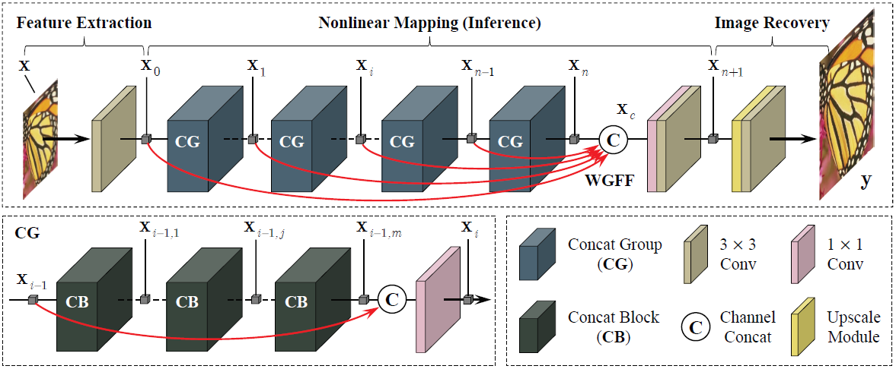

FC2N: Fully Channel-Concatenated Network for Single Image Super-Resolution
================

e-print: <a href="https://arxiv.org/abs/1907.03221?context=eess.IV">https://arxiv.org/abs/1907.03221?context=eess.IV</a>

Xiaole Zhao, Ying Liao, Ye Li, Tao Zhang, and Xueming Zou

Introduction
--------
Most current image super-resolution (SR) methods based on deep convolutional neural networks (CNNs) use residual learning in network structural design, which contributes to effective back propagation, thus improving SR performance by increasing model scale. However, deep residual network suffers some redundancy in model representational capacity by introducing short paths and therefore cannot make full mining of model capacity. In addition, blindly enlarging the model scale will cause more problems in model training, even with residual learning. We present a novel CNN structure to make full use of model representational capacity, i.e., fully channel-concatenated network (FC2N)， whose key structural design is the **weighted channel-concatenatopn**. To our best knowledge, FC2N is the first CNN-based SR model **without the use of residual learning** to achieve 400-layer network depth, and the first CNN model that achieves state-of-the-art SR performance with **less than 10M model parameters**. Moreover, it shows good SR performance in both large-scale and small-scale implementations.

Dependencies
--------

Pretrained models and Results
--------

Model training
--------

Testing
--------

Citations
--------

