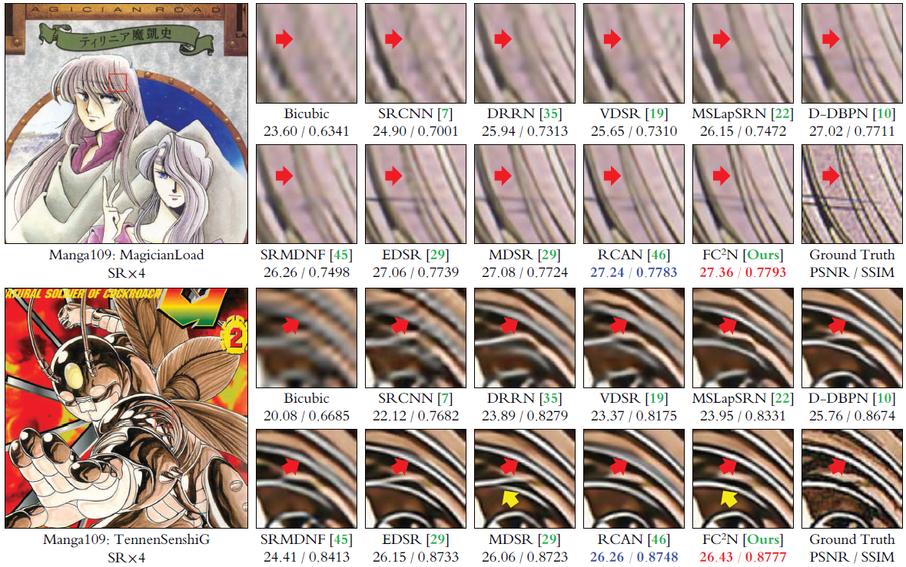
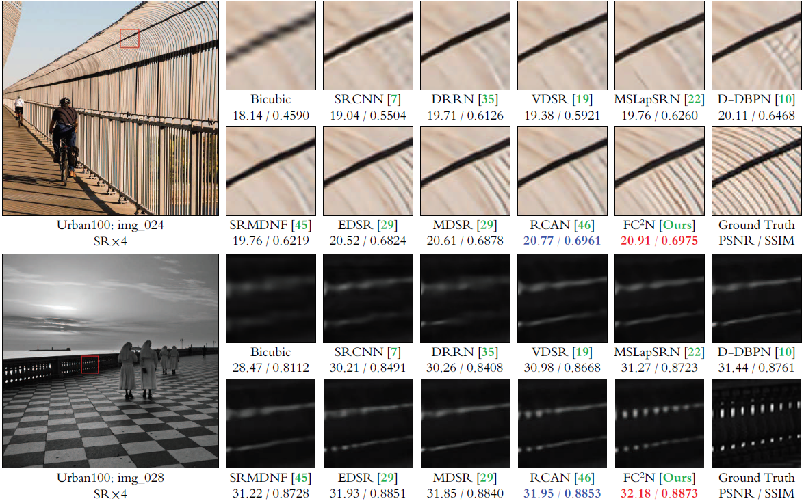

FC<sup>2</sup>N: Fully Channel-Concatenated Network for Single Image Super-Resolution
================


e-print: <a href="https://arxiv.org/abs/1907.03221?context=eess.IV">https://arxiv.org/abs/1907.03221?context=eess.IV</a>

[Xiaole Zhao](https://zxlation.github.io/xiaole.github.com/), Ying Liao, Ye Li, Tao Zhang, and Xueming Zou

Introduction
--------
Most current image super-resolution (SR) methods based on deep convolutional neural networks (CNNs) use residual learning in network structural design, which contributes to effective back propagation, thus improving SR performance by increasing model scale. However, deep residual network suffers some redundancy in model representational capacity by introducing short paths and therefore cannot make full mining of model capacity. In addition, blindly enlarging the model scale will cause more problems in model training, even with residual learning. We present a novel CNN structure to make full use of model representational capacity, i.e., fully channel-concatenated network (FC<sup>2</sup>N)， whose key structural design is the **weighted channel-concatenation**. To our best knowledge, FC<sup>2</sup>N is the first CNN-based SR model that **does not use residual learning and reaches network depth over 400 layers**, and the first CNN model that **achieves state-of-the-art SR performance with less than 10M model parameters**. Moreover, it shows good SR performance in both large-scale and small-scale implementations.

Dependencies
--------
* TensorFlow >= 1.9.0
* Python >= 3.5
* Numpy >= 1.15.0
* Imageio 2.3.0
* Termcolor


Pretrained models
--------
Some pretrained models are available at the following link: `FC2N/records/FC2N/`. Note the results generated from these pretrained models may be slightly different from those in the paper. 

[https://pan.baidu.com/s/1eli43BzEF7KgNrT68jtWQw](https://pan.baidu.com/s/1eli43BzEF7KgNrT68jtWQw)


Testing results
--------
The testing results on benchmark datasets for X2, X3 and X4 is also available at the URL shown above: `FC2N/works/`. If you need the results of FC<sup>2</sup>N for visual comparison, you are free to download these results.


Training
--------
To train the FC<sup>2</sup>N, you need to download the training data from the link above first: `FC2N/FC2N-datasets/`, and place them in the work directory of this project: `./datasets/DIV2K/...`. You can check whether the data is loaded correctly by running the 'data_loader.py'.

Next, you need to check whether the options for model training are set correctly, which are contained in the script 'options.py'.

Then to train the model, simply run the script 'train.py'.

Testing
--------
After the model is well trained, the network parameters are stored in the directory: `./records/FC2N/`. 

Check the options in the script 'options.py', and run 'test.py' (possibly require a little modification to this script).

Examples of super-resolution
--------




Citations
--------

```citation
    @article{Zhao2019FC2N,
        title   = {FC2N: Fully channel-concatenated network for single image super-resolution},
        author  = {Zhao, Xiaole and Liao, Ying and Li, Ye and Zhang, Tao and Zou, Xueming},
        journal = {arXiv preprint arXiv:1907.03221?context=eess.IV},
        year    = {2019}
    }
```


